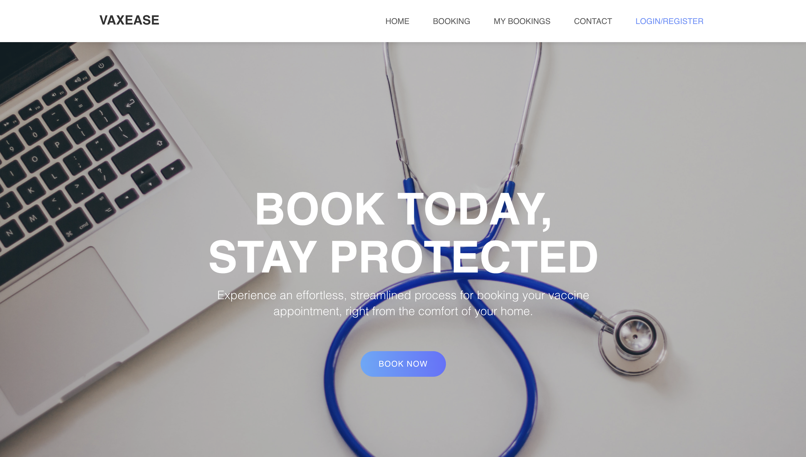
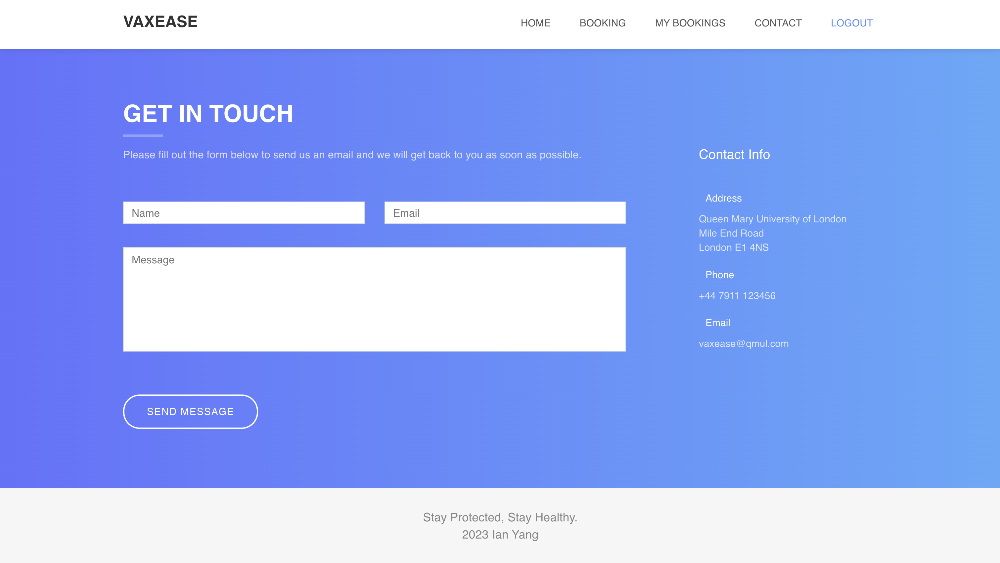
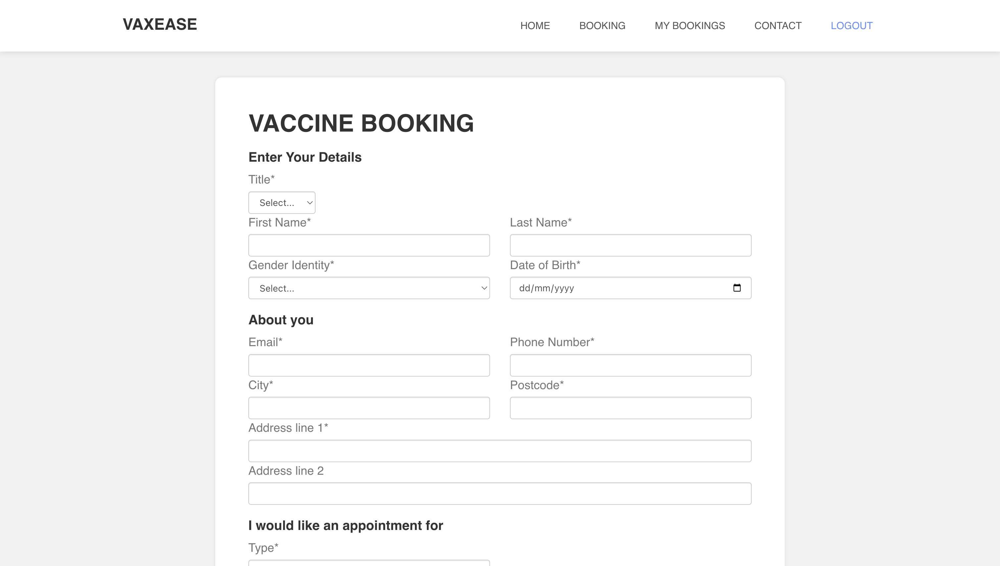

# Vaxease

## Introduction

This is a full-stack web app built by the MERN stack with authentication, offering a platform for users to book vaccine appointments and check their bookings.

## Tech Stack
- Frontend: React.js, Bootstrap
- Backend: Node.js, Express.js
- Database: MongoDB
- Authentication: JWT, bcrypt

## Demo
### Landing Page

### Contact Page

### Booking Page

## Features

1. **Landing Page**  
   The landing page is designed as a clean and informative entry point to the website, styled with Bootstrap for responsive design and user-friendly layout.

2. **Contact Us Section**  
   The "Contact Us" section adopts `EmailJS` for email communication, allowing visitors to easily reach out to the team.

4. **Booking Page**  
   A booking page features a structured form where users can input their details and schedule a vaccine slot.

5. **My Booking Page with Access Control**  
   - **User Role:** Users logging in with regular accounts can view only their personal appointment records.
   - **Admin Role:** Administrators have access to all booking records, ensuring efficient management of vaccination schedules.

6. **Authentication**  
   - **Login/Register Page:** Users can sign up or log in via a unified authentication page.
   - **Password Encryption:** Passwords are hashed using bcrypt for secure storage.
   - **Session Cookies & JWT:** User sessions are maintained using cookies, and JWT tokens are employed to manage authentication.